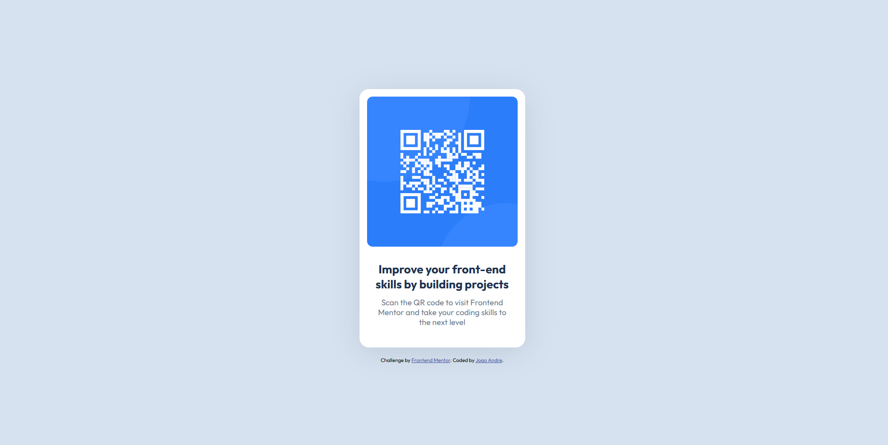

# Frontend Mentor - QR code component solution

This is a solution to the [QR code component challenge on Frontend Mentor](https://www.frontendmentor.io/challenges/qr-code-component-iux_sIO_H). Frontend Mentor challenges help you improve your coding skills by building realistic projects. 

## Table of contents

- [Overview](#overview)
  - [Screenshot](#screenshot)
  - [Links](#links)
- [My process](#my-process)
  - [Built with](#built-with)
- [Author](#author)

## Overview

### Screenshot

### Links

- Solution URL: [Qr Code Component Solution](https://github.com/joaomfandre99/frontendmentor/tree/main/qr-code-component)
- Live Site URL: [Qr Code Component Pages](https://joaomfandre99.github.io/frontendmentor/qr-code-component/)

## My process

### Built with

- Semantic HTML5 markup
- CSS custom properties
- Flexbox

## Author

- Github - [joaomfandre99](https://github.com/joaomfandre99)
- Frontend Mentor - [@joaomfandre99](https://www.frontendmentor.io/profile/joaomfandre99)
