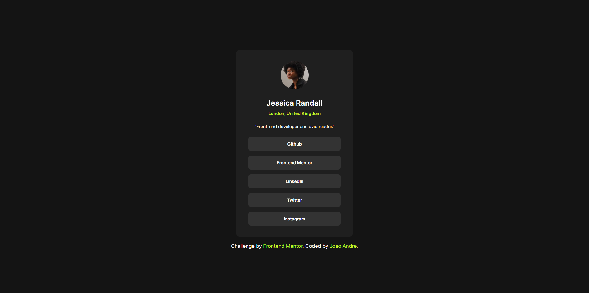

# Frontend Mentor - Social links profile solution

This is a solution to the [Social links profile challenge on Frontend Mentor](https://www.frontendmentor.io/challenges/social-links-profile-UG32l9m6dQ). Frontend Mentor challenges help you improve your coding skills by building realistic projects. 

## Table of contents

- [Overview](#overview)
  - [The challenge](#the-challenge)
  - [Screenshot](#screenshot)
  - [Links](#links)
- [My process](#my-process)
  - [Built with](#built-with)
  - [What I learned](#what-i-learned)
  - [Continued development](#continued-development)
- [Author](#author)

## Overview

### The challenge

Users should be able to:

- See hover and focus states for all interactive elements on the page

### Screenshot



### Links

- Solution URL: [Social Links Profile Solution](https://github.com/joaomfandre99/frontendmentor/tree/main/social-links-profile-component)
- Live Site URL: [Social Links Profile Pages](https://joaomfandre99.github.io/frontendmentor/social-links-profile-component/)

## My process

### Built with

- Semantic HTML5 markup
- CSS custom properties
- Flexbox

### What I learned

During this challenge I had to use media query to make the card responsive in mobile layouts because I was having a hard time making the card responsive while only using its width.

```css
@media only screen and (max-width: 400px) {
    .card {
        padding: 30px 40px;
    }
}
```

### Continued development

Something I'll be focusing on future projects will be making applying good CSS practices and make each class reusable in different scenarios. Another thing I want to improve is the usage of media queries to improve responsiveness.

## Author

- Github - [joaomfandre99](https://github.com/joaomfandre99)
- Frontend Mentor - [@joaomfandre99](https://www.frontendmentor.io/profile/joaomfandre99)